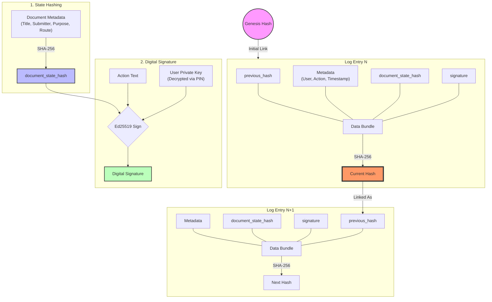

# Hash Chain Functionality (The Trust Builder)

This document visualizes the cryptographic logic used by the **Document Tracking System (DTS)** to ensure document immutability, non-repudiation, and chronological integrity.

## 📊 Logic Flow Diagram

## 🔐 Core Security Properties

1.  **State Integrity (The Snapshot):** Every log captures a `document_state_hash`. If a document's title or submitter info is modified directly in the database, the live state hash will no longer match the historical record stored in the last log. This triggers the **Active Guard** (via `DocumentPolicy`) and auto-freezes the document.

2.  **Non-Repudiation (The Bond):** The Ed25519 digital `signature` is mathematically bonded to both the `Action Text` and the `document_state_hash`. This ensures that a user cannot later claim they signed a different version of the document or authorized a different action.

3.  **Chain Continuity (The Link):** Each log entry stores the `previous_hash` of the preceding log. Because the `Current Hash` is a SHA-256 result of all current data (including the `previous_hash`), any alteration to a historical entry—even a single millisecond in a timestamp—invalidates every subsequent block in that document's specific chain.

4.  **Micro-Sharding (The Scale):** Unlike a global blockchain, the DTS utilizes independent hash chains for every document. This ensures that an integrity failure in one record does not halt the entire system and maintains $O(\log n)$ performance during verification.

---
*Refer to `app/Models/DocumentLog.php` for the implementation of this logic.*
