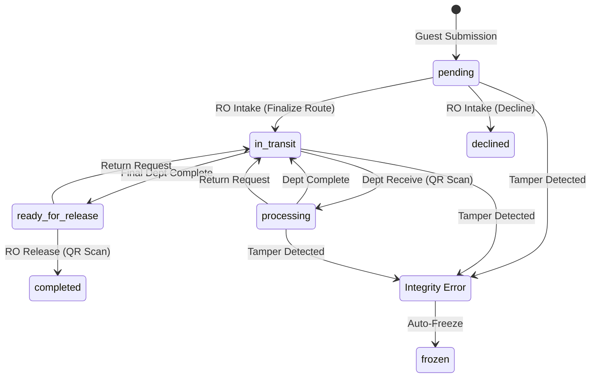

# DTS Architecture & Core Logic

## Summary
A technical deep-dive into the foundations of the Document Tracking System (DTS). This document covers the security models, AI-driven routing, document lifecycle management, and the architectural safeguards that ensure system integrity and resilience.

## Table of Contents
1. [Role-Based Access Control (RBAC)](#1-role-based-access-control-rbac)
2. [Document Lifecycle & Statuses](#2-document-lifecycle--statuses)
3. [AI Route Prediction Engine](#3-ai-route-prediction-engine)
4. [Document Hashing & Integrity (The Trust Builder)](#4-document-hashing--integrity-the-trust-builder)
5. [Resilience & Fallback Strategies](#5-resilience--fallback-strategies)

---

## 1. Role-Based Access Control (RBAC)

RBAC is the security foundation of the DTS, ensuring that users only access the data and actions necessary for their specific job functions.

### The "Traffic Cop" (Middleware)
The core logic resides in `app/Http/Middleware/RoleMiddleware.php`. This middleware performs two vital functions:
1.  **Initial Redirection**: Routes the generic `/dashboard` to role-specific entry points.
2.  **Gatekeeping**: Blocks unauthorized access to role-protected routes using Laravel's middleware parameters.

```php
// Redirect logic in RoleMiddleware
return match ($user->role) {
    'admin' => redirect()->route('admin.dashboard'),
    'officer' => redirect()->route('intake'),
    'staff' => redirect()->route('staff.tasks'),
    default => abort(403),
};
```

### Automated Provisioning
When an Administrator creates a user, the system automatically handles:
- **Department Assignment**: Links the user to a functional unit (e.g., Cash Unit).
- **Signature Readiness**: Prepares the profile for Ed25519 digital signature initialization.

---

## 2. Document Lifecycle & Statuses

The document lifecycle follows a structured, non-linear path. A document is physically tracked via QR codes at every handoff point.

### Lifecycle State Machine


### Status Definitions
| Status | Description |
|:---|:---|
| **`pending`** | Initial state; awaiting Records Office intake and route finalization. |
| **`declined`** | Terminal state; rejected during intake due to invalidity or missing data. |
| **`in_transit`** | Document is physically moving between departments or to releasing. |
| **`processing`** | Document has been scanned and is being worked on by a department. |
| **`ready_for_release`** | Internal processing complete; sitting in the Records Office release queue. |
| **`completed`** | Terminal state; physically handed back to the guest. |
| **`frozen`** | Administrative lock; triggered by integrity failure or manual override. |

---

## 3. AI Route Prediction Engine

The DTS employs a **Weighted TF-IDF (Term Frequency-Inverse Document Frequency)** engine to predict document routes.

### Prediction Logic
1.  **Context Assembly**: Combines `Title` + `Purpose` into a single input string.
2.  **Tokenization**: Splits text, converts to lowercase, and filters out non-semantic "stopwords" (e.g., "the", "and", "N/A").
3.  **Scoring**:
    *   **TF**: Frequency of the keyword in the current input.
    *   **Weight**: Learned frequency of this keyword's association with a department.
    *   **IDF**: `log(Total Documents / Documents containing this Keyword)`.
4.  **Ranking**: Departments are ranked by cumulative score, with guest-preferred departments receiving an automatic priority boost.

### The Learning Loop
When a Records Officer manually corrects a route, the `UpdateKeywordWeights` job:
-   **Increments Weight**: Strengthens the association between tokens and the chosen department.
-   **Increments Document Count**: Updates the global frequency used for IDF calculations.

---

## 4. Document Hashing & Integrity (The Trust Builder)

The "Trust Builder" ensures absolute non-repudiation and data immutability through cryptographic bonding.

### The Cryptographic Block
Every log entry acts as a block in a chain. The hash of each block is calculated using:
1.  **Previous Hash**: The `hash` of the preceding log entry (Genesis uses `genesis_hash`).
2.  **State Hash**: A SHA-256 snapshot of the Document's metadata (Title, Submitter, Tracking Code).
3.  **Digital Signature**: An **Ed25519** signature generated using the user's private key (encrypted with their PIN).
4.  **Transaction Data**: Document ID, User ID, Action, and ISO-8601 Timestamp.

### Integrity Verification (Two-Layer Audit)
-   **Layer 1 (Chain)**: Recalculates every block hash from the genesis log forward to detect historical tampering.
### Layer 2 (Live): Secure Context & Protocol Symmetry
To ensure the safety of mobile QR scanning and cryptographic operations, the system enforces a **Secure Context**:
- **Protocol Symmetry**: The `AppServiceProvider` forces the `https` scheme if the application URL is configured with HTTPS.
- **Trust Proxies**: Configured in `bootstrap/app.php` (`$middleware->trustProxies(at: '*')`), ensuring Laravel correctly identifies the protocol and generates secure links when running behind an HTTPS proxy (Nomadic Setup).
- **HMR Synchronization**: The development environment utilizes mDNS (`.local`) and an HTTPS proxy to bridge external device traffic, unlocking camera APIs for real-time tracking on mobile hardware.

---

## 5. Resilience & Fallback Strategies


### Memory-Safe Processing
To handle 1,000,000+ records, the system avoids "The RAM Trap" by:
-   **SQL-Level Aggregation**: Using MySQL Window Functions (`LAG()`, `OVER()`) for analytics instead of PHP loops.
-   **PDF Chunking**: Generating large reports in batches of 250, saving chunks to disk, and merging them using `libmergepdf`.

### Fail-Safe Defaults
-   **AI Fallback**: If no keywords match, the system defaults to the `Records Unit` to prevent orphaned documents.
-   **Queue Resilience**: Workers are configured with `--tries=3` and `--timeout=1200` to survive heavy processing loads.
-   **Auto Restart**: Workers are configured with `while true;` and `sleep 10` meaning the workers auto restart themselves after 10 seconds.
