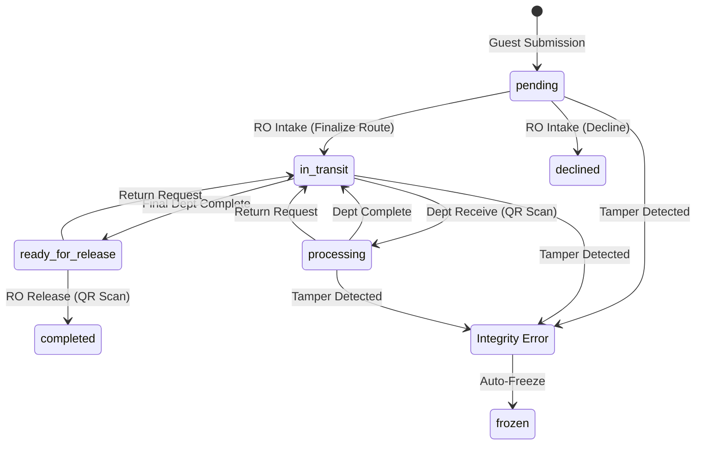

# DTS Architecture & Core Logic

## Summary
A technical deep-dive into the architectural foundations of the Document Tracking System (DTS). This document explains the security models, AI-driven routing, document lifecycle management, and the cryptographic safeguards that ensure system integrity and non-repudiation.

## Table of Contents
1. [Role-Based Access Control (RBAC)](#1-role-based-access-control-rbac)
2. [Document Lifecycle & Statuses](#2-document-lifecycle--statuses)
3. [AI Route Prediction Engine](#3-ai-route-prediction-engine)
4. [Document Hashing & Integrity (The Trust Builder)](#4-document-hashing--integrity-the-trust-builder)
5. [Resilience & Fallback Strategies](#5-resilience--fallback-strategies)
6. [Glossary of Terms](#6-glossary-of-terms)

---

## 1. Role-Based Access Control (RBAC)

RBAC is the security foundation of the DTS, ensuring that users only access the data and actions necessary for their job functions.

### The "Traffic Cop" (Middleware)
The core logic resides in `app/Http/Middleware/RoleMiddleware.php`. Think of this as a digital traffic cop that checks your "Access Badge" before you enter a room.
1.  **Smart Redirection**: If you log in without a specific page in mind (the `/dashboard`), the cop checks your badge and sends you to the right starting point:
    *   **Admins** go to the analytics suite.
    *   **Officers** go to the Intake queue.
    *   **Staff** go to their departmental Task list.
2.  **Gatekeeping**: If a Staff member tries to sneak into an Admin page by guessing the URL, the cop blocks the request and shows a `403 Unauthorized` error.

### Automated Provisioning
When an Administrator creates a user, the system automatically handles:
- **Unit Linking**: Connects the user to a functional unit (e.g., Cashier).
- **Signature Readiness**: Prepares the profile for digital signature setup.

---

## 2. Document Lifecycle & Statuses

The document lifecycle follows a structured, non-linear path. A document is physically tracked via QR codes at every "Handoff" point.

### Lifecycle State Machine

### Key Status Definitions
| Status | Simplified Meaning |
|:---|:---|
| **`pending`** | Awaiting review. The document is in the "Waiting Room." |
| **`in_transit`** | Physically moving. It's in an envelope traveling between desks. |
| **`processing`** | Active work. A department has scanned it and is working on it. |
| **`ready_for_release`** | Finished. It's waiting for the guest to pick it up. |
| **`completed`** | Closed. The guest has walked away with their papers. |
| **`frozen`** | Locked. The system detected a security problem and disabled all actions. |

---

## 3. AI Route Prediction Engine

The DTS employs a **Weighted TF-IDF** engine—a "Smart Assistant" that learns how to route documents based on past experience.

### Prediction Logic
1.  **Context Assembly**: The AI reads the `Title` and the `Purpose` together to understand the full story.
2.  **Filtering**: It ignores "Filler Words" (e.g., "the," "and," "N/A") to focus only on important keywords like "Salary," "Appointment," or "Refund."
3.  **The Learning Loop**: This is where the AI gets smarter. When a human (the Records Officer) manually corrects a route, the system takes note. 
    *   *Example:* If a document says "Water Bill" and the human sends it to the "Cash Unit," the system increases the "connection" between "Water" and "Cash." The next time it sees "Water," it will suggest "Cash Unit" automatically.

---

## 4. Document Hashing & Integrity (The Trust Builder)

The "Trust Builder" ensures absolute **Non-Repudiation**—meaning once you sign an action, you can never deny it happened.

### The Cryptographic Block
Every log entry acts as a link in a chain. If you change even one letter in an old log, the "Digital Seal" (the Hash) breaks, and the whole chain becomes invalid.
- **State Hash**: A digital snapshot of the document (Title, Submitter).
- **Digital Signature**: An **Ed25519** signature generated using your private PIN. It's math-based proof that *you* performed the action.

### The "Active Guard" (Two-Layer Audit)
- **Layer 1 (The Past)**: Recalculates the chain from the very first log to make sure no one edited the history.
- **Layer 2 (The Present)**: Compares the "Live Document" on the screen with the last "Signed Snapshot." If they don't match exactly, the system "Auto-Freezes" the document to prevent further tampering.

---

## 5. Resilience & Fallback Strategies

### Memory-Safe Processing
To handle millions of documents, we use "Batch Processing." Instead of reading a 10,000-page report all at once, we generate 100 pages at a time and "stitch" them together. This prevents the server from running out of memory.

### Secure Context & Protocol Symmetry
To use the phone's camera for QR scanning, the browser requires a "Secure Context" (HTTPS). 
- **Protocol Symmetry**: The system automatically upgrades all links to `https://` if configured, ensuring the camera stays active across all devices.

---

## 6. Glossary of Terms

*   **Ed25519**: A type of unbreakable "Digital Signature" that proves who you are without revealing your secret password.
*   **HMR (Hot Module Replacement)**: A technology that updates the system's code in real-time without needing to refresh the page.
*   **Immutable**: Something that cannot be changed after it's created. Once a log is saved, it's locked forever.
*   **mDNS (.local)**: A way for devices on the same network (like a phone and a server) to talk to each other by name (e.g., `dts.local`) without needing an IP address.
*   **Middleware**: A "Gatekeeper" script that checks if a request is safe or authorized before letting it reach the main system.
*   **Non-Repudiation**: A technical guarantee that someone cannot say "It wasn't me" after they have signed an action.
*   **RBAC (Role-Based Access Control)**: A system where your "Role" (Admin, Staff, etc.) determines what you can see and do.
*   **SHA-256**: A mathematical "Seal" that creates a unique fingerprint for a piece of data.
*   **State Hash**: A "Snapshot" of a document's details taken at a specific moment in time.
*   **TF-IDF**: A math formula used by the AI to decide which keywords are the most important in a sentence.
