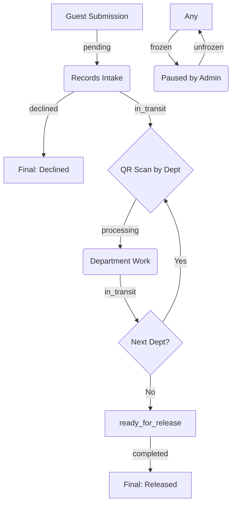

# Document Lifecycle & Statuses

This document outlines the various states a document can inhabit within the Document Tracking System (DTS), the business logic behind each status, and the specific triggers that transition a document from one state to another.

## Table of Contents
1. [Workflow Overview](#workflow-overview)
2. [Detailed Status Definitions](#detailed-status-definitions)
3. [Status Transitions & Triggers](#status-transitions--triggers)
4. [Administrative & Edge Cases](#administrative--edge-cases)

---

## Workflow Overview

The document lifecycle follows a non-linear but structured path, moving from a public submission into a multi-department processing queue, and finally back to a centralized release point.

---

## Detailed Status Definitions

### 1. `pending`
-   **Definition:** The entry point of the system. A document is created by a guest but has not yet been reviewed by the Records Office.
-   **User Experience:** Guests can track their code but will see "Awaiting Intake."

### 2. `declined`
-   **Definition:** A terminal state. The Records Officer has rejected the submission (e.g., missing attachments or invalid purpose).
-   **User Experience:** Guests see the "Decline Reason" and can no longer track updates.

### 3. `in_transit`
-   **Definition:** The document is physically moving between locations. It is no longer with the previous handler but hasn't been "Received" (scanned) by the next one.
-   **User Experience:** Accountability is maintained; the system shows exactly who it is moving toward.

### 4. `processing`
-   **Definition:** The document has been scanned and received by a department. It is actively being worked on and appears in the department's "Tasks" list.
-   **User Experience:** The system reflects that work is currently being performed by a specific unit.

### 5. `ready_for_release`
-   **Definition:** All processing steps in the route are complete. The document has been physically returned to the Records Office and is ready for the guest to pick up.
-   **User Experience:** Guests see "Ready for Pickup."

### 6. `completed`
-   **Definition:** A terminal state. The document has been physically handed back to the guest, and the Records Officer has marked it as officially released.
-   **User Experience:** Guests can now provide a star rating/feedback.

### 7. `frozen`
-   **Definition:** A high-level administrative pause. Used when an integrity error (hash mismatch) is detected or during internal investigations.
-   **User Experience:** Progress is halted; no department can scan or process the document until unfrozen.

---

## Status Transitions & Triggers

| Current Status | Target Status | Triggering Action | Controller/Method |
|:---|:---|:---|:---|
| **None** | `pending` | Guest submits the public form. | `GuestController@store` |
| `pending` | `in_transit` | Records Officer accepts and finalizes the route. | `DocumentController@finalize` |
| `pending` | `declined` | Records Officer rejects the submission. | `DocumentController@decline` |
| `in_transit` | `processing` | Assigned department scans the document QR code. | `DocumentController@scan` |
| `processing` | `in_transit` | Staff marks a processing step as complete. | `TaskController@complete` |
| `in_transit` | `ready_for_release`| Records Unit scans a document with all steps completed. | `ReleasingController@receive` |
| `ready_for_release` | `completed` | Records Officer marks as physically released. | `ReleasingController@complete` |

---

## Administrative & Edge Cases

### The "Return Request" (Non-Linearity)
While the workflow is generally linear, a department can "Return" a document to a previous step. This resets the `current_step` but keeps the status as `in_transit` until the target department scans it again.

### Manual Override (Unfreeze)
When an admin unfreezes a document, it currently defaults back to `processing`. This allows the handler to continue their work once the investigation is resolved.
